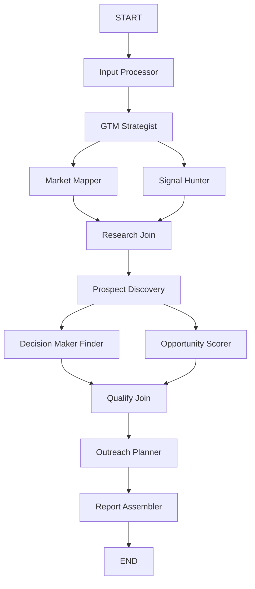

# GTMaxxin

**AI-powered GTM intelligence — orchestrated by an 11-agent swarm.**

Describe your company and product. GTMaxxin maps markets, hunts buying signals, discovers prospects, scores opportunities, and drafts personalized outreach — then delivers a full GTM report you can watch agents build in real time.

> Built for the **Microsoft AI Hack — Agent Swarm** track.

---

## Live demo

| | |
|---|---|
| **Web app** | [gtmaxxin.app](https://gtmaxxin.app) |
| **Repository** | [github.com/SJ2006-stack/msft_ai_hack_agent_swarm](https://github.com/SJ2006-stack/msft_ai_hack_agent_swarm) |

Try the **Load demo input** button on the homepage, then launch a run. The report page streams agent status, logs, and the final GTM intelligence output.

---

## Table of contents

- [What it does](#what-it-does)
- [Quick start (judges & organizers)](#quick-start-judges--organizers)
- [Run locally](#run-locally)
- [Environment variables](#environment-variables)
- [Agent swarm architecture](#agent-swarm-architecture)
- [Tech stack](#tech-stack)
- [Deploy to Cloudflare Workers](#deploy-to-cloudflare-workers)
- [Development scripts](#development-scripts)
- [Project structure](#project-structure)
- [Why this fits Agent Swarm](#why-this-fits-agent-swarm)

---

## What it does

**Input**

- Company description
- Product description
- Website URL *(optional — scraped via Firecrawl when configured)*

**Output**

- Ideal Customer Profiles & buyer personas
- Primary, secondary, and adjacent market segments
- Buying signals with citations
- Qualified prospects matched to ICPs
- Decision-maker targets per prospect
- Ranked opportunities (fit, intent, timing, accessibility)
- Outreach angles, email drafts, and LinkedIn messages
- Executive summary report *(exportable as per-agent JSON ZIP)*

This is not a chatbot. Each agent has a specialized role, shared graph state, and independent reasoning — coordinated by **LangGraph** with parallel fan-out and fan-in.

---

## Quick start (judges & organizers)

### Option A — Use the hosted demo (fastest)

1. Open **[gtmaxxin.app](https://gtmaxxin.app)**
2. Click **Load demo input** (or enter your own company / product)
3. Click **Launch swarm**
4. Watch the live agent graph, activity log, and report sections fill in (~2–3 min with real LLMs)

No install required.

### Option B — Clone and run locally

**Prerequisites:** [Node.js 22+](https://nodejs.org/), [pnpm 9+](https://pnpm.io/installation)

```bash
# 1. Clone the repo
git clone https://github.com/SJ2006-stack/msft_ai_hack_agent_swarm.git
cd msft_ai_hack_agent_swarm

# 2. Install dependencies
pnpm install

# 3. Configure environment
cp .env.example .env.local
# Edit .env.local — at minimum set OPENROUTER_API_KEY (see below)

# 4. Start the dev server
pnpm dev
```

Open [http://localhost:3000](http://localhost:3000), launch a run, and follow the redirect to `/report/[runId]`.

### Option C — Smoke test the agent graph (CLI)

Validates all 11 agents, parallel joins, and Zod output contracts without opening the UI:

```bash
# Fast stub run (~5s) — no API keys needed
MOCK_LLM=true pnpm smoke

# Full run with real LLMs (~2–3 min) — requires OPENROUTER_API_KEY
MOCK_LLM=false MOCK_TOOLS=false pnpm smoke
```

### Option D — Deploy your own instance (Cloudflare)

See [Deploy to Cloudflare Workers](#deploy-to-cloudflare-workers). You need a Cloudflare account, an OpenRouter API key, and optionally Firecrawl / Tavily keys for live web research.

---

## Run locally

| Step | Command |
|------|---------|
| Install | `pnpm install` |
| Dev server | `pnpm dev` |
| Typecheck | `pnpm typecheck` |
| Graph smoke test | `pnpm smoke` |
| LangGraph Studio | `pnpm langgraph:dev` |
| Cloudflare preview | `pnpm cf:dev-vars && pnpm preview` |

**LangGraph Studio** (`pnpm langgraph:dev`) lets you step through the swarm graph, inspect state at each node, and verify parallel branches (Market Mapper ∥ Signal Hunter, Decision Maker Finder ∥ Opportunity Scorer). See [`docs/langsmith-run.md`](docs/langsmith-run.md) for tracing and golden-fixture runs.

---

## Environment variables

Copy [`.env.example`](.env.example) to `.env.local`. Never commit secrets.

| Variable | Required | Description |
|----------|----------|-------------|
| `OPENROUTER_API_KEY` | **Yes** (real runs) | [OpenRouter](https://openrouter.ai/) API key |
| `OPENROUTER_MODEL` | No | Default: `openrouter/free` (auto-selects free models) |
| `FIRECRAWL_API_KEY` | No | Website scraping — falls back to mock when `MOCK_TOOLS=true` |
| `TAVILY_API_KEY` | No | Web search for signals & prospects |
| `LANGCHAIN_TRACING_V2` | No | Set `true` to enable LangSmith tracing |
| `LANGCHAIN_API_KEY` | No | LangSmith API key |
| `LANGCHAIN_PROJECT` | No | Default: `gtmaxxin` |
| `MOCK_LLM` | No | `true` = stub LLM responses (fast dev / CI) |
| `MOCK_TOOLS` | No | `true` = stub Firecrawl & Tavily |

**Minimum for a real demo:** `OPENROUTER_API_KEY` with `MOCK_LLM=false` and `MOCK_TOOLS=false`. Tool keys improve research quality but are optional.

---

## Agent swarm architecture

Eleven specialized agents run on a **LangGraph** `StateGraph` with two parallel stages:



| Agent | Role |
|-------|------|
| **Input Processor** | Normalizes company, product, and optional URL context |
| **GTM Strategist** | ICPs, personas, industries, value proposition |
| **Market Mapper** | Primary, secondary, and adjacent market segments |
| **Signal Hunter** | Buying intent signals (funding, hiring, expansion, etc.) |
| **Research Join** | Synchronizes parallel research branches |
| **Prospect Discovery** | High-fit companies matched to ICPs |
| **Decision Maker Finder** | Stakeholder roles and contact targets |
| **Opportunity Scorer** | Fit, intent, timing, and accessibility scores |
| **Qualify Join** | Synchronizes qualification branches |
| **Outreach Planner** | Angles, “why now / why them”, email & LinkedIn drafts |
| **Report Assembler** | Executive summary and final GTM report |

Runs emit **SSE stream events** (agent status + logs) persisted to **Cloudflare KV**, so the report page updates live while the swarm executes in the background via `waitUntil`.

---

## Tech stack

| Layer | Technology |
|-------|------------|
| **Frontend** | Next.js 15, React 19, Tailwind CSS 4, shadcn/ui, React Flow, Framer Motion |
| **Agent orchestration** | LangGraph, LangSmith (optional tracing) |
| **LLM routing** | OpenRouter (`@openrouter/sdk`) |
| **Research tools** | Firecrawl (scrape), Tavily (search) |
| **Run persistence** | Cloudflare KV (`RUNS_KV`) |
| **Deployment** | OpenNext + Cloudflare Workers (`@opennextjs/cloudflare`, Wrangler) |
| **Validation** | Zod schemas on all agent I/O |

---

## Deploy to Cloudflare Workers

Production runs on **Cloudflare Workers** with OpenNext. CI deploys on push to `main` via [`.github/workflows/deploy-cloudflare.yml`](.github/workflows/deploy-cloudflare.yml).

### One-time Cloudflare setup

1. Create a [Cloudflare account](https://dash.cloudflare.com/sign-up)
2. Create a **KV namespace** for run storage and note its ID
3. Update [`wrangler.jsonc`](wrangler.jsonc):
   - Set `kv_namespaces[0].id` to your KV namespace ID
   - Adjust `vars` as needed (`MOCK_LLM`, `MOCK_TOOLS`, `OPENROUTER_MODEL`)
4. Create an [OpenRouter API key](https://openrouter.ai/keys)

### Deploy from your machine

```bash
pnpm install

# Sync secrets from .env.local to the Worker
cp .env.example .env.local
# Fill in OPENROUTER_API_KEY (and optional tool keys)
pnpm cf:sync-secrets

# Build and deploy
pnpm deploy
```

For local Cloudflare preview (closer to production):

```bash
pnpm cf:dev-vars   # writes .dev.vars from .env.local
pnpm preview       # opennext build + wrangler preview
```

### GitHub Actions secrets

For automated deploys, add these repository secrets:

| Secret | Purpose |
|--------|---------|
| `CLOUDFLARE_API_TOKEN` | Worker deploy token |
| `CLOUDFLARE_ACCOUNT_ID` | Cloudflare account ID |

Upload Worker secrets separately with `pnpm cf:sync-secrets` (not stored in GitHub).

---

## Development scripts

| Script | Description |
|--------|-------------|
| `pnpm dev` | Next.js dev server |
| `pnpm build` | Production Next.js build |
| `pnpm smoke` | End-to-end graph smoke test |
| `pnpm langgraph:dev` | LangGraph Studio UI |
| `pnpm preview` | OpenNext + Wrangler local preview |
| `pnpm deploy` | Build and deploy to Cloudflare Workers |
| `pnpm cf:sync-secrets` | Push secrets from `.env.local` to Worker |
| `pnpm cf:dev-vars` | Generate `.dev.vars` for local Wrangler preview |
| `pnpm typecheck` | TypeScript check |
| `pnpm test-node` | Test a single agent in isolation (`--agent gtm_strategist`) |

---

## Project structure

```
app/                       # Next.js routes + API
  page.tsx                 # Landing + launch form
  report/[runId]/page.tsx  # Live swarm dashboard + GTM report
  api/report/              # Run, stream, export endpoints

components/
  home/                    # Hero, stepper, graph preview, chat demo
  swarm/                   # Agent flow graph, activity log, inspector
  report/                  # ICP, markets, signals, prospects, outreach
  ui/                      # shadcn primitives

swarm/                     # LangGraph agent pipeline (start here for agents)
  graph.ts                 # StateGraph wiring + parallel fan-out/fan-in
  orchestrator.ts          # Node wrapper, joins, output extraction
  state.ts / events.ts     # Shared graph state + SSE event types
  agents/<name>/           # One folder per agent (node.ts + prompt.ts)
  shared/                  # LLM node helper, logger, citations, validation
  tools/                   # Tavily, Firecrawl, mock toggles

server/                    # Backend services (not agent logic)
  llm/openrouter.ts        # OpenRouter streaming client
  runs/store.ts            # KV-backed run + SSE persistence
  export/                  # Per-agent JSON ZIP export

fixtures/                  # Demo input + mock slices (non-production)
types/                     # GTM Zod schemas + agent registry
hooks/                     # Client hooks (report stream, scroll reveal)
lib/utils.ts               # Shared UI utilities (cn, etc.)

scripts/
  dev/                     # smoke-swarm.ts, test-node.ts
  deploy/                  # Cloudflare secret sync + dev vars

infra/
  langgraph.json           # LangGraph Studio entrypoint

docs/                      # Architecture, agents, deployment guides
wrangler.jsonc             # Cloudflare Worker + KV config
```

### Where do I change…?

| Goal | Location |
|------|----------|
| Add or edit an agent | `swarm/agents/<agent-name>/` (`node.ts` + `prompt.ts`) |
| Change graph topology | `swarm/graph.ts` |
| UI for live run dashboard | `app/report/`, `components/swarm/`, `components/report/` |
| API routes | `app/api/report/` |
| Run persistence (KV) | `server/runs/store.ts` |
| Deploy / secrets | `wrangler.jsonc`, `scripts/deploy/`, [docs/deployment-cloudflare.md](docs/deployment-cloudflare.md) |
| Demo / mock data | `fixtures/` |
| LangGraph Studio | `pnpm langgraph:dev` → `infra/langgraph.json` |

See [docs/README.md](docs/README.md) for the full documentation index.

---

## Why this fits Agent Swarm

GTMaxxin demonstrates **true multi-agent orchestration**, not a single prompt chain:

- **Specialized agents** — each node owns one GTM task with its own system prompt and JSON schema
- **Shared state** — LangGraph `Annotation` reducers merge outputs across the pipeline
- **Parallel execution** — `Send` API fans out research and qualification branches, then joins synchronize
- **Observable swarm** — real-time status, logs, React Flow graph, and optional LangSmith traces
- **Production edge deployment** — full Next.js app + long-running swarm on Cloudflare Workers with KV persistence

The business problem — *who should we sell to, why now, and how should we approach them?* — requires decomposition that a single agent cannot reliably solve alone.

---

**Questions?** Open an issue on [GitHub](https://github.com/SJ2006-stack/msft_ai_hack_agent_swarm/issues) or try the live demo at [gtmaxxin.app](https://gtmaxxin.app). See [CONTRIBUTING.md](CONTRIBUTING.md) to hack on the swarm.

---

## License

MIT — see [LICENSE](LICENSE).

