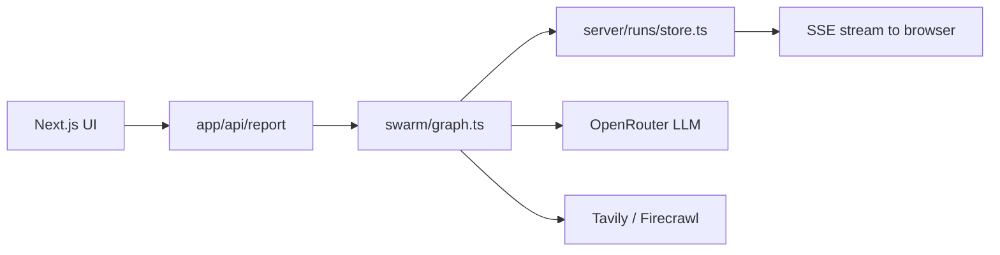
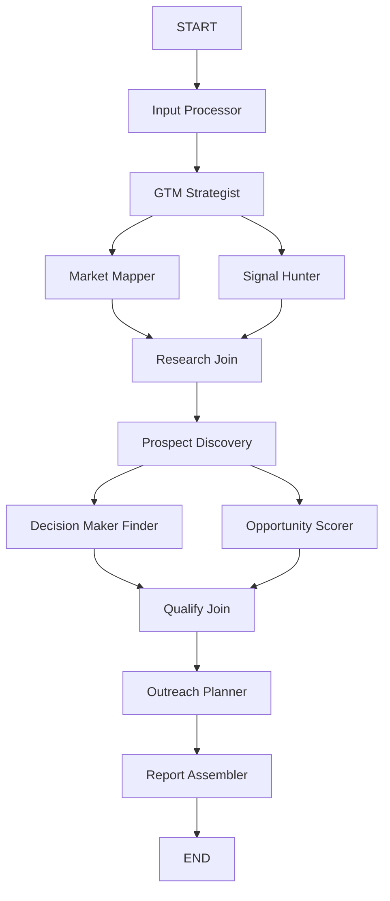

# Architecture

GTMaxxin is a Next.js app with a LangGraph agent pipeline. The UI launches runs via API routes; the swarm executes in the background and streams status to the browser via SSE.

## High-level flow

## Swarm graph

Eleven agents on a `StateGraph` with two parallel stages:

**Parallel branches**

1. After GTM Strategist: Market Mapper ∥ Signal Hunter → Research Join
2. After Prospect Discovery: Decision Maker Finder ∥ Opportunity Scorer → Qualify Join

## Code layout

| Layer | Path | Responsibility |
|-------|------|----------------|
| Swarm | `swarm/` | LangGraph graph, agents, tools, shared helpers |
| Server | `server/` | KV persistence, export, OpenRouter client |
| App | `app/` | Pages and API routes |
| UI | `components/` | React components by feature |
| Types | `types/` | Zod schemas + agent registry |
| Fixtures | `fixtures/` | Demo input and mock LLM slices |

## Run lifecycle

1. `POST /api/report/run` — validates input, creates run in KV, starts graph via `waitUntil`
2. Graph emits `status` and `log` events → appended to KV
3. Client opens `GET /api/report/[runId]/stream` — SSE replay + live updates
4. `GET /api/report/[runId]` — snapshot of state, logs, agent outputs
5. `GET /api/report/[runId]/export` — ZIP of per-agent JSON

## State model

Shared state lives in `swarm/state.ts` (`GTMReportState`). LangGraph `Annotation` reducers merge partial updates from each node. Agent statuses drive the React Flow graph on the report page.

## Deployment

Production uses **OpenNext + Cloudflare Workers** with a **KV** binding (`RUNS_KV`). See [deployment-cloudflare.md](./deployment-cloudflare.md).
